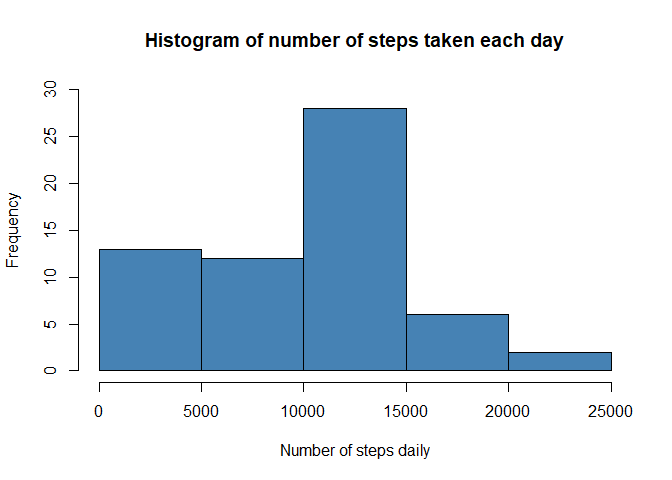
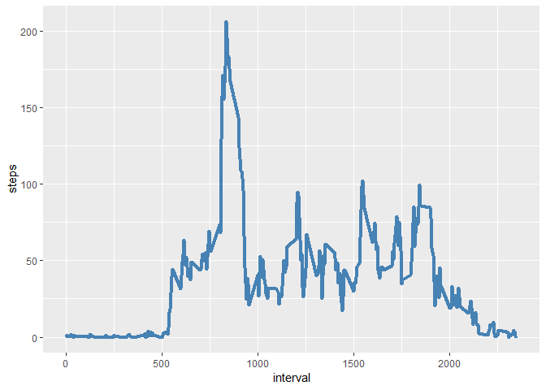
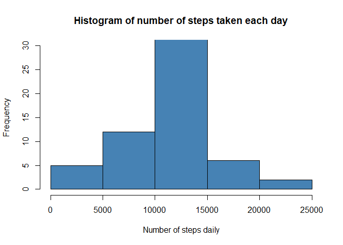
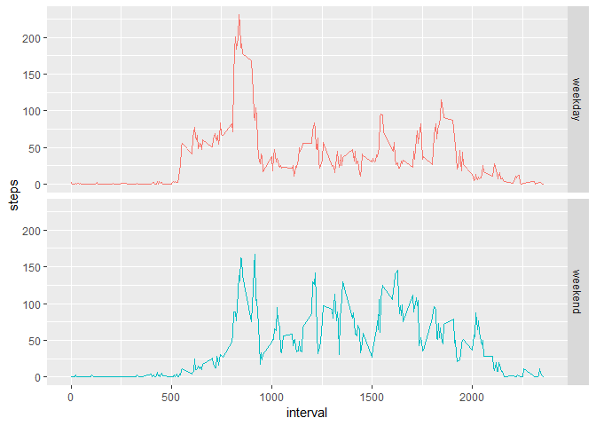

## Loading and preprocessing the data

The following packages are required to process the data: 

```r
library(knitr)
library(dplyr)
```

```
## 
## Attaching package: 'dplyr'
```

```
## The following objects are masked from 'package:stats':
## 
##     filter, lag
```

```
## The following objects are masked from 'package:base':
## 
##     intersect, setdiff, setequal, union
```

```r
library(lubridate)
```

```
## 
## Attaching package: 'lubridate'
```

```
## The following object is masked from 'package:base':
## 
##     date
```

```r
library(ggplot2)
```

The data is first downloaded from the provided url and saved. 

```r
#download file
if(!file.exists("./data")){dir.create("./data")}
url <- "https://d396qusza40orc.cloudfront.net/repdata%2Fdata%2Factivity.zip"
download.file(url, destfile = "./data/activity.zip")
unzip("./data/activity.zip", exdir="./data")
path <- file.path("./data")
```

It is then loaded in R and the date is formatted using lubridate.

```r
#reading and loading the data
df <- tbl_df(read.csv(file.path(path,"activity.csv"), header = TRUE, na.strings = "NA")) %>%
    mutate(date = ymd(date))
```

## What is mean total number of steps taken per day?
The data is grouped by date using dplyr and the total numbers of steps taken each day is summed. 

```r
dfday <- df %>%
    group_by(date) %>%
    summarize_at(vars(steps), sum, na.rm=T)
```

A histogram is then plotted of the total number of steps taken each day. 

```r
hist(dfday$steps, col="steel blue", 
     ylim = c(0,30),
     main="Histogram of number of steps taken each day", 
     xlab="Number of steps daily")
```

<!-- -->


```r
daymean <- round(mean(dfday$steps))
daymedian <- round(median(dfday$steps))
```
The mean number of steps is 9354 and the median number of steps is 1.0395\times 10^{4}.

## What is the average daily activity pattern?
To examine the average daily activity pattern, we first calculate the average steps for each interval.

```r
dfinterval <- df %>%
    group_by(interval) %>%
    summarize_at(vars(steps), mean, na.rm=T)
```

The line plot belows shows the average steps taken at each 5 minute interval

```r
ggplot(dfinterval, aes(interval, steps)) + 
    geom_line(color="steel blue", lwd=1.5)
```

<!-- -->


```r
intervalmax <- dfinterval$interval[which.max(dfinterval$steps)]
```
The 5 minute interval which contains the maximum number of steps is 835.

## Imputing missing values


```r
numNA <- length(which(is.na(df$steps)))
```
The total number of missing values in the data set is 2304

To impute the missing values, we replaced the NA values by the corresponding interval means and saved the result in a new data set, *dfimputed*.

```r
dfimputed <- df %>%
    group_by(interval) %>%
    mutate(steps = ifelse(is.na(steps), mean(steps, na.rm=T), steps)) #replacing NA by respective interval means
```
We computed the new daily average steps with the imputed values and plotted a new histogram. 

```r
dfimputedday <- dfimputed %>%
    group_by(date) %>%
    summarize_at(vars(steps), sum, na.rm=T)

hist(dfimputedday$steps, col="steel blue", 
     ylim = c(0,30),
     main="Histogram of number of steps taken each day", 
     xlab="Number of steps daily")
```

<!-- -->


```r
dayimputedmean <- round(mean(dfimputedday$steps))
dayimputedmedian <- round(median(dfimputedday$steps))
```
The new daily mean number of steps is 1.0766\times 10^{4} and the new daily median is 1.0766\times 10^{4}. Both these new values are higher than the previous values calculated without imputation. 

## Are there differences in activity patterns between weekdays and weekends?
To answer this, we first created a new variable *weekend* to distinguish between weekdays and weekends. 

```r
dfimputed <- dfimputed %>%
    mutate(dotw = wday(date, label=TRUE)) %>%
    mutate(weekend = ifelse(dotw %in% c("Sat","Sun"), "weekend", "weekday"))
```
We then calculated the mean number of steps at each interval for weekends and weekdays. 

```r
dfimputedinterval <- dfimputed %>%
    group_by(interval, weekend) %>%
    summarize_at(vars(steps), mean, na.rm=T)
```
The plot below shows that there are some differences in activities across weekend and weekdays in terms of max number of steps at each interval as well as average activity patterns across the day. 

```r
ggplot(dfimputedinterval, aes(interval, steps)) +
    geom_line(aes(color=weekend)) +
    facet_grid(weekend ~.) +
    theme(legend.position = "none") 
```

<!-- -->
